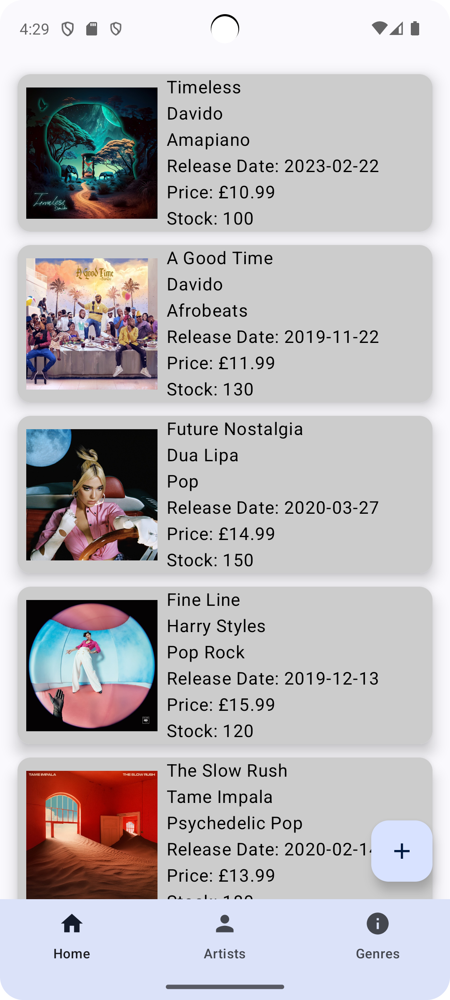
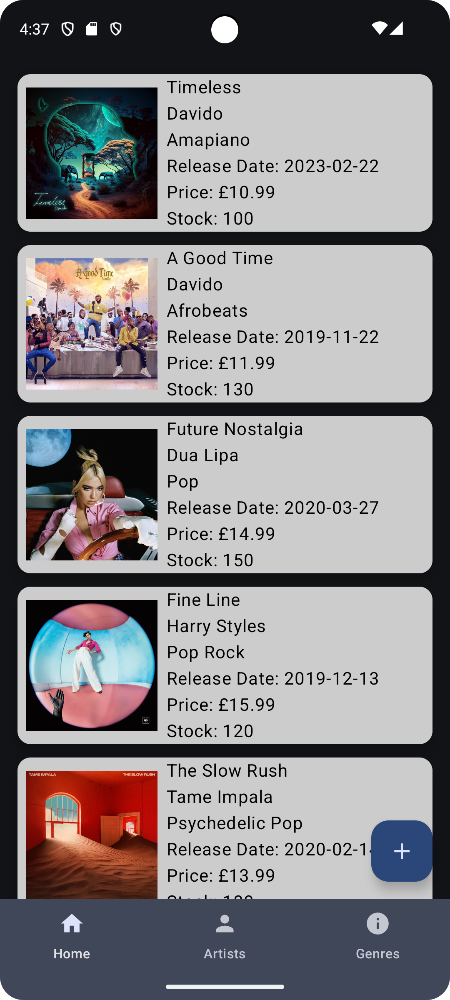
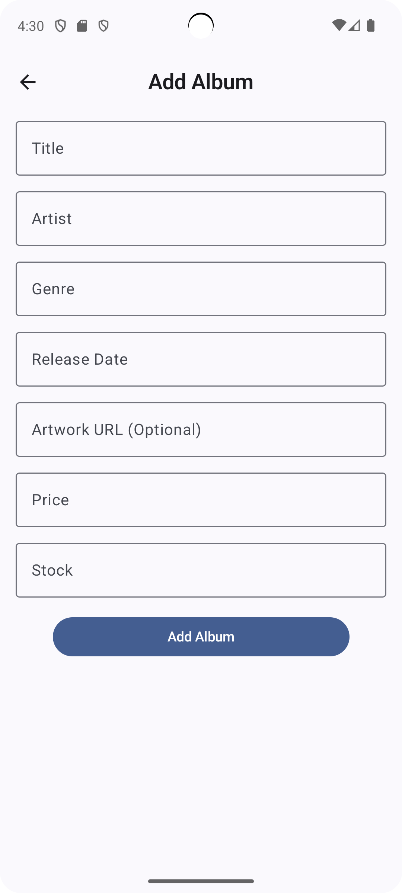
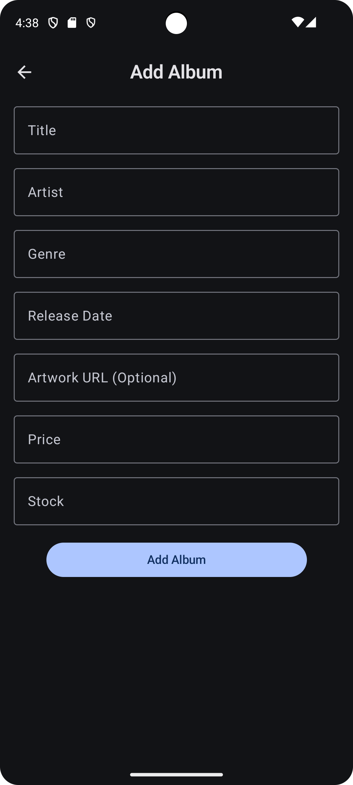
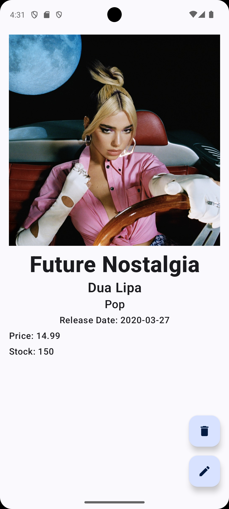
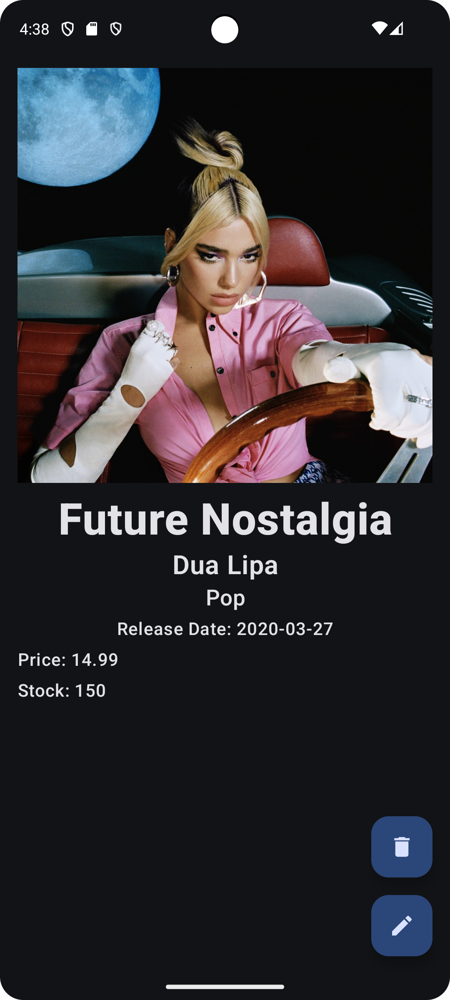
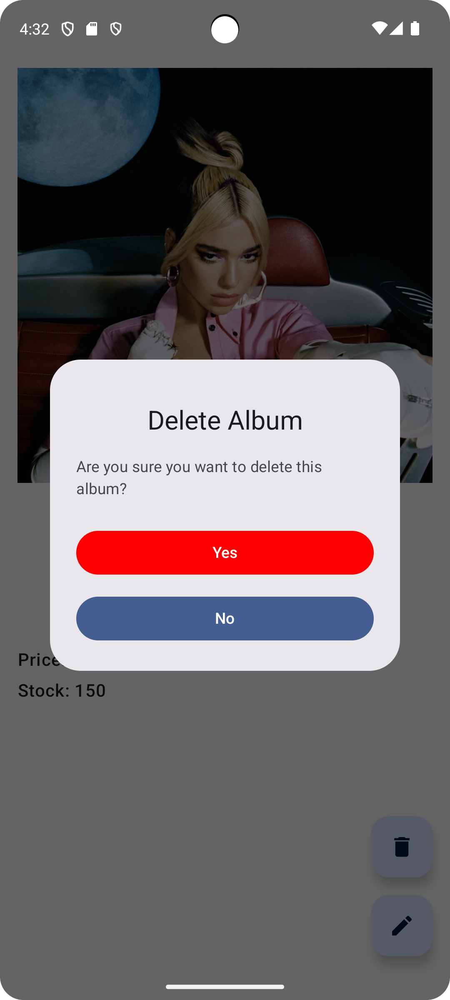
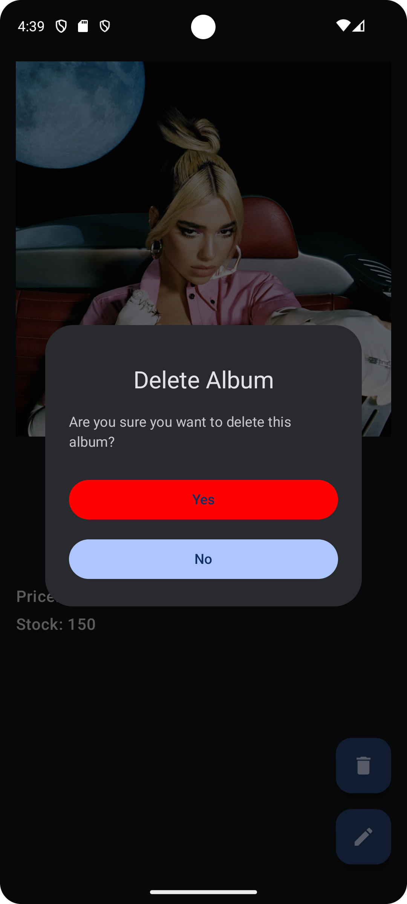
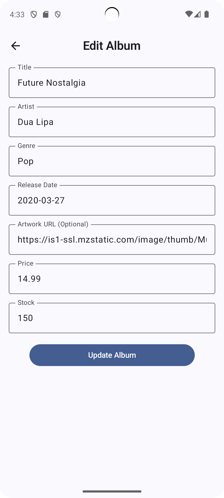
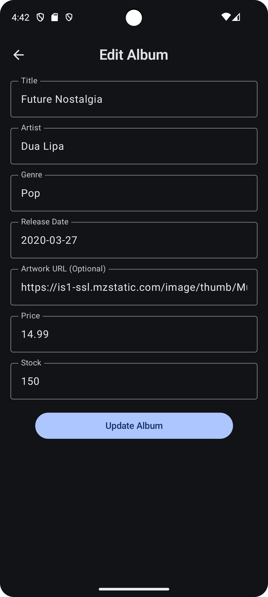

# Record Shop - Android Frontend 🎵
A modern and user-friendly record shop Android application built with Jetpack Compose for the frontend and Spring Boot for the backend.
## Overview
This application provides a digital platform for browsing, searching, and managing a record shop inventory. The app features a clean, intuitive interface designed with Jetpack Compose, Google's modern toolkit for building native Android UI.
## Features ✨
- Full integration with [Record Shop Backend API](https://github.com/tchabva/recordshopbackend)
- Browse record catalogue with cover art and details
- Search functionality with instant results
- Adaptive dark/light theme
- Responsive UI for different screen sizes
- Smooth animations and transitions

## Tech Stack 🛠️
### Frontend:
- Kotlin
- Jetpack Compose
- MVVM Architecture
- Material Design Components
- Dependency Injection: Hilt
- Networking: Retrofit, Kotlin Coroutines
- Image Loading: Glide Compose
- Navigation: Compose Navigation
### Backend:
The application requires the backend service to function properly:
- [Record Shop Backend](https://github.com/tchabva/recordshopbackend)
- Built with Spring Boot using Java
- RESTful API design
- Postgres Database Integration

## Screenshots
<table>
  <!-- Row 1 -->
  <tr>
    <td style="text-align:center">
      
      <p><em>Record Shop Home Screen</em></p>
    </td>
    <td style="text-align:center">
      
      <p><em>Record Shop Home Screen Dark Mode</em></p>
    </td>
  </tr>

  <!-- Row 2 -->
  <tr>
    <td style="text-align:center">
      
      <p><em>Add Album Screen</em></p>
    </td>
    <td style="text-align:center">
      
      <p><em>Add Album Screen Dark Mode</em></p>
    </td>
  </tr>

<!-- Row 3 -->
  <tr>
    <td style="text-align:center">
      
      <p><em>View Album Screen</em></p>
    </td>
    <td style="text-align:center">
      
      <p><em>View Album Screen Dark Mode</em></p>
    </td>
  </tr>

  <!-- Row 4 -->
  <tr>
    <td style="text-align:center">
      
      <p><em>View Album Screen Delete Album Dialog</em></p>
    </td>
    <td style="text-align:center">
      
      <p><em>View Album Screen Delete Album Dialog Dark Mode</em></p>
    </td>
  </tr>

<!-- Row 5 -->
  <tr>
    <td style="text-align:center">
      
      <p><em>Edit Album Screen</em></p>
    </td>
    <td style="text-align:center">
      
      <p><em>Edit Album Screen Dark Mode</em></p>
    </td>
  </tr>
</table>

## Getting Started
### Prerequisites ⚙️
1. Android Studio Flamingo or newer
2. JDK 11+
3. An Android device running API 21 (Lollipop) or higher
4. Backend server running (see setup instructions below)

### Installation
1. Clone the repository:
    ```bash
    git clone https://github.com/tchabva/Recordshop-Frontend-Compose.git
    ```
2. Open the project in Android Studio and let Gradle sync the project.
3. Set up the backend server. Follow the README:
    - Clone and run the [Record Shop Backend](https://github.com/tchabva/recordshopbackend)
4. Configure the local.properties file (see Configuration section below)
5. Build & run the application on your device or emulator

### Configuration
The app requires proper configuration in the `local.properties` file to connect to the backend service. This file is automatically generated when you first open the project in Android Studio, but you need to add the backend configuration manually.

> **Important**: The `local.properties` file is automatically ignored by Git and should never be committed to version control as it contains environment-specific configuration.

#### Setting up local.properties

1. **Locate the local.properties file** in the root directory of the project (same level as `build.gradle.kts`)

2. **Add the following configuration** to your `local.properties` file:
    ```properties
    # Android SDK location (automatically added by Android Studio)
    sdk.dir=/path/to/your/Android/Sdk
    
    # Backend API URLs
    base.url.backend.wireless=http://YOUR_WIRELESS_IP:8080/api/v1/
    base.url.backend=http://10.0.2.2:8080/api/v1/
    wireless.ip=YOUR_WIRELESS_IP
    ```

3. **Replace the placeholder values:**
   - `YOUR_WIRELESS_IP`: Replace with your computer's IP address on your local network
   - The `base.url.backend` uses `10.0.2.2` which is the Android emulator's way to access the host machine's localhost

#### Finding Your Wireless IP Address

**On Windows:**
```cmd
ipconfig
```
Look for "IPv4 Address" under your active network adapter.

**On macOS/Linux:**
```bash
ifconfig | grep "inet " | grep -v 127.0.0.1
```
Or use:
```bash
hostname -I
```

#### Example Configuration
```properties
sdk.dir=/home/user/Android/Sdk
base.url.backend.wireless=http://192.168.1.100:8080/api/v1/
base.url.backend=http://10.0.2.2:8080/api/v1/
wireless.ip=192.168.1.100
```

#### Backend Setup
1. Clone the backend repository:
    ```bash
    git clone https://github.com/tchabva/recordshopbackend.git
    ```
2. Follow the backend README to set up and run the Spring Boot application
3. Ensure the backend is running on port 8080
4. Verify the backend is accessible at `http://localhost:8080/api/v1/`

#### Network Security Configuration
The app automatically generates a network security configuration file (`network_security_config.xml`) during the build process. This allows the app to make HTTP requests to your local backend server, which is necessary for development.

The configuration is generated from the `wireless.ip` value in your `local.properties` file and includes:
- `10.0.2.2` (Android emulator's localhost)
- Your wireless IP address for physical device testing

#### Testing the Configuration
- **For Emulator**: The app will use `base.url.backend` (10.0.2.2:8080)
- **For Physical Device**: The app will use `base.url.backend.wireless` (your wireless IP:8080)

Make sure both your computer and Android device are on the same network when testing on a physical device.

### Troubleshooting
- **Connection Issues**: Verify that the backend server is running and accessible
- **Network Security**: The app automatically generates network security config to allow HTTP traffic to your backend
- **IP Address Changes**: If your network IP changes, update the `wireless.ip` and `base.url.backend.wireless` values in `local.properties`
- **Port Conflicts**: Ensure port 8080 is not being used by other applications